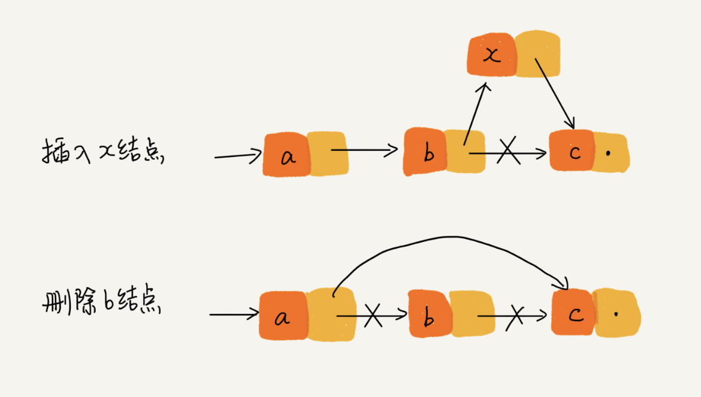

# 02\_LinkedList

* 链表是什么
  * 链表是一组通过指针串联起来的一组零散的内存块，这个内存块称为链表的结点 
  * 结点内除了储存了数据 还储存了指向下一个结点的 **后继指针 next** 
    * \(双向链表的结点中还存有一个指向上一个结点的 **前驱结点 prev**\)
  * 常见的链表有 单链表、双向链表、循环链表
  * 我们习惯把第一个结点叫作**头结点** 最后一个结点叫作**尾结点**
    * 其中头结点用来记录链表的基地址 有了它可以遍历它得到整条链表
    * （单链表）尾结点的指针永远指向一个**空地址 NULL** 表示这是链表上最后一个结点

## 算法题

> 如何判断一个字符串（单链来储存的）是否是回文字符串

**解题思想：**

* 反转单链表 再比较下他俩是否一致 O\(n\)
* 把链表转换成数组 再做比较 O\(n\)

> 单链表反转

* 每次遍历链表的时候 把指针反转

> 链表中环的检测

* 遍历链表的时候 把结点地址存入 set 中 来对比当前结点的 next 在不在 set 中
* 快慢指针

> 两个有序的链表合并

* 把连个链表装入一个 array 中 排序后再转成链表
* 两个链表的结点一个一个对比 然后插入

> 删除链表倒数第 n 个结点

* 声明两个指针 两个指针之间相差 n 当快指针为 null 的时候 慢指针的 next 就是要删除的指针

> 求链表的中间结点

* 
