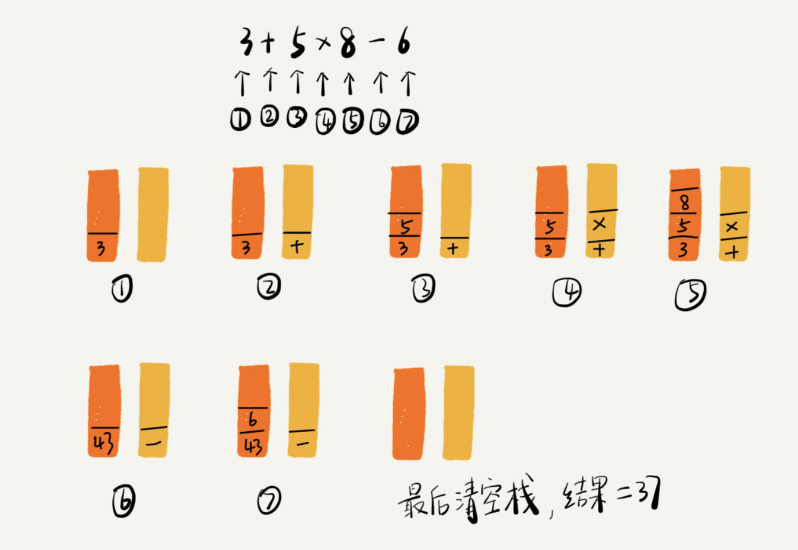

# 03\_Stack

* 栈是什么
  * 栈是一种操作受限的线性表，只允许在一端插入和删除数据
  * 有先进先出 后进后出的特性
  * 栈可以用数组和链表来实现 数组实现的栈叫顺序栈 链表实现的栈叫链式栈
  * 如果要实现一个支持动态扩容的顺序栈则需要在底层依赖一个支持动态扩容的数组就行了

```text
#import "XXStack.h"

@implementation XXStack

- (instancetype)init {
    return [self initWithStackCapacity:0];
}

- (instancetype)initWithStackCapacity:(NSUInteger)capacity {
    if (self = [super init]) {
        _stackCapacity = capacity;
        _arrayStack = [NSMutableArray arrayWithCapacity:capacity];
    }

    return self;
}

//    判断栈有没有空间
- (BOOL)isOverflow {
    return (self.count >= self.stackCapacity);
}

//    判断栈是否为空
- (BOOL)isNull {
    return (0 == self.count);
}

//    入栈
- (BOOL)push:(id __nullable)obj {
    if ([self isOverflow]) {
        NSLog(@"栈已满");
        return NO;
    }

    self.arrayStack[self.count] = obj;
    ++self.count;

    return YES;
}

//    出栈
- (id)pop {
    if ([self isNull]) {
        NSLog(@"栈为空");
        return NULL;
    }

    id tmp = self.arrayStack[self.count - 1];
    [self.arrayStack removeLastObject];

    --self.count;

    return tmp;
}

@end
```

## 使用栈来实现四则运算



## 算法题

* 使用栈来判断有效括号

```text
@implementation XXValidParentheses

- (BOOL)isLegal:(NSString *)str {
    if (str.length == 0) {
        NSLog(@"请输入有效的字符串");
        return NO;
    }

    XXStack *stack = [[XXStack alloc] initWithStackCapacity:100];
    NSDictionary *parenDict = @{
                                @")" : @"(",
                                @"]" : @"[",
                                @"}" : @"{",
                                };

    NSMutableArray *arr = [NSMutableArray arrayWithCapacity:0];

    for (int i = 0; i < str.length; ++i) {
        [arr addObject:[str substringWithRange:NSMakeRange(i, 1)]];
    }

    for (NSString *a in arr) {
        if (![parenDict.allKeys containsObject:a]) {
            [stack push:a];
        } else if (!!(stack.count)) {
            BOOL isSame = [parenDict[a] isEqualToString:[stack pop]];
            if (!isSame) {
                return NO;
            }
        }
    }

    return !(stack.count);
}

@end
```

